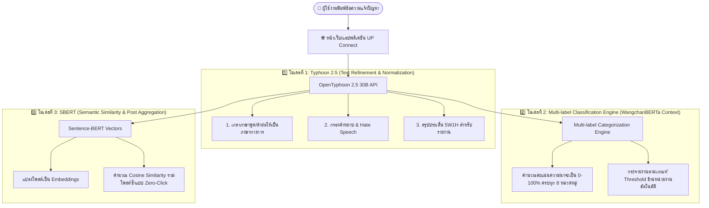

# 🧠 สถาปัตยกรรมและกระบวนการทำงานของระบบปัญญาประดิษฐ์ (AI Architecture & Workflows)
## โครงการระบบรับฟังเสียงและจัดการปัญหาภายในมหาวิทยาลัยพะเยา (UP Connect)

เอกสารนี้รวบรวมรายละเอียด **โมเดลปัญญาประดิษฐ์ (AI) ทั้ง 3 โมเดล**, **ระบบจำแนกหลายหมวดหมู่ (Multi-label Classification)**, **เกณฑ์การตัดสินใจส่งต่อใบงาน (Confidence Cutoff Threshold)**, **กรณีศึกษาอุบัติเหตุข้ามหน่วยงาน (Cross-Department Routing)**, ตลอดจน **ขั้นตอนกระบวนการทำงานตั้งแต่ต้นจนจบ (Workflows)**

---

## 📌 1. ภาพรวมสถาปัตยกรรม 3 โมเดล AI ของระบบ UP Connect



---

## 🏛️ 2. รายละเอียดหน้าที่ของทั้ง 3 โมเดล

### 1️⃣ โมเดลที่ 1: Typhoon 2.5 (`typhoon-v2.5-30b-a3b-instruct`)
* **หน้าที่:** รับข้อความดิบ (Raw Text) จากผู้ใช้งาน ทำหน้าที่เป็นด่านหน้าในการเกลาคำผิด, กรองคำหยาบคาย/ข้อความไม่สุภาพ, และเรียบเรียงให้ออกมาเป็นภาษาทางการที่มีโครงสร้าง 5W1H (What, Where, When, Who, Why, How)
* **จุดเด่น:** เข้าใจไวยากรณ์และบริบทภาษาไทยระดับสูงมากจาก SCB 10X

### 2️⃣ โมเดลที่ 2: Multi-label Classification Model (WangchanBERTa)
* **หน้าที่:** คำนวณค่าความน่าจะเป็น (Probability Distribution) แยกอิสระในทุกๆ หมวดหมู่ปัญหาของมหาวิทยาลัยพะเยา (0% – 100%)
* **จุดเด่น:** สามารถจับความหมายของปัญหาที่มีความคาบเกี่ยวหลายหน่วยงานพร้อมกัน (Multi-label) โดยไม่บังคับเลือกเพียงหมวดเดียว

### 3️⃣ โมเดลที่ 3: Sentence-BERT / SBERT (`paraphrase-multilingual-MiniLM-L12-v2`)
* **หน้าที่:** แปลงประโยคของแต่ละโพสต์ให้กลายเป็นจุด Vector แล้วคำนวณค่าความคล้ายคลึงเชิงความหมาย (Cosine Similarity)
* **จุดเด่น:** รวมโพสต์ที่แจ้งเรื่องเดียวกันในสถานที่เดียวกันเข้ามาไว้ในตั๋วใบงานเดียว (Zero-Click Ticket Aggregation) ช่วยให้แอดมินเห็นภาพรวมปัญหาโดยหน้าฟีดไม่รก

---

## 🐕🦺 3. กรณีศึกษา: "รถเมล์ชนหมาตายเลือดสาดที่ตึก PKY" (Multi-label & Cross-Department Routing)

เหตุการณ์ในชีวิตจริง 1 เหตุการณ์ มักคาบเกี่ยวความรับผิดชอบของหลายหน่วยงานพร้อมกัน:

```
[ผู้ใช้พิมพ์: "รถเมล์ชนหมาตายเลือดสาดที่ตึก PKY"]
                 │
                 ▼
[AI คำนวณคะแนนความเกี่ยวข้องแยกตามหมวดหมู่]
 ├── 🚗 การเดินทางและระบบขนส่ง (รถเมล์)     : 91% ✅ (เกิน Threshold)
 ├── 🛡️ ความปลอดภัยและจราจร (อุบัติเหตุรถชน) : 91% ✅ (เกิน Threshold)
 ├── 🧹 ภูมิทัศน์และความสะอาด (ซากสัตว์/เลือด) : 96% ✅ (เกิน Threshold)
 ├── 🏢 อาคารและสิ่งอำนวยความสะดวก (ตึก PKY) : 14% ❌ (ต่ำกว่า Threshold)
 └── 💻 ระบบเครือข่ายและเทคโนโลยี           :  2% ❌ (ต่ำกว่า Threshold)
                 │
                 ▼
[Super Admin ตั้งเกณฑ์ Cutoff Threshold ไว้ที่ 70%]
                 │
                 ▼
┌──────────────────────────────────────────────────────────────┐
│ 🚀 ระบบส่งต่อใบงานไปยัง 3 หน่วยงานพร้อมกันในคลิกเดียว:         │
│   1. ฝ่ายยานพาหนะ/ขนส่ง ➔ ตรวจสอบกรณีรถเมล์เฉี่ยวชน         │
│   2. ฝ่ายความปลอดภัย/จราจร ➔ ตรวจสอบอุบัติเหตุและกล้องวงจรปิด  │
│   3. ฝ่ายอาคารสถานที่/แม่บ้าน ➔ เก็บซากสัตว์และล้างทำความสะอาด  │
│                                                              │
│ 🛡️ หมวดไอทีและอาคาร (14%, 2%) ถูกตัดทิ้ง ไม่ส่งไปรบกวนเจ้าหน้าที่ │
└──────────────────────────────────────────────────────────────┘
```

---

## 🎛️ 4. การควบคุมและตั้งค่าโดย Super Admin ในแดชบอร์ด

Super Admin สามารถเข้าไปที่หน้า **`LLM Settings` ➔ แท็บ `Multi-label & Auto-Routing`** เพื่อ:
1. **ปรับสไลเดอร์เกณฑ์ความมั่นใจ (Confidence Cutoff Threshold):** เลื่อนปรับได้ตั้งแต่ `10%` ถึง `95%`
2. **ทดสอบด้วย Live Routing Simulator:** มีกล่องให้พิมพ์ประโยคจำลองหรือคลิกปุ่มพรีเซ็ต เพื่อดูคะแนน % ของทุกหมวดหมู่และดูว่าหน่วยงานใดจะได้รับใบงานแบบ Real-time ก่อนบันทึกการตั้งค่าจริง
