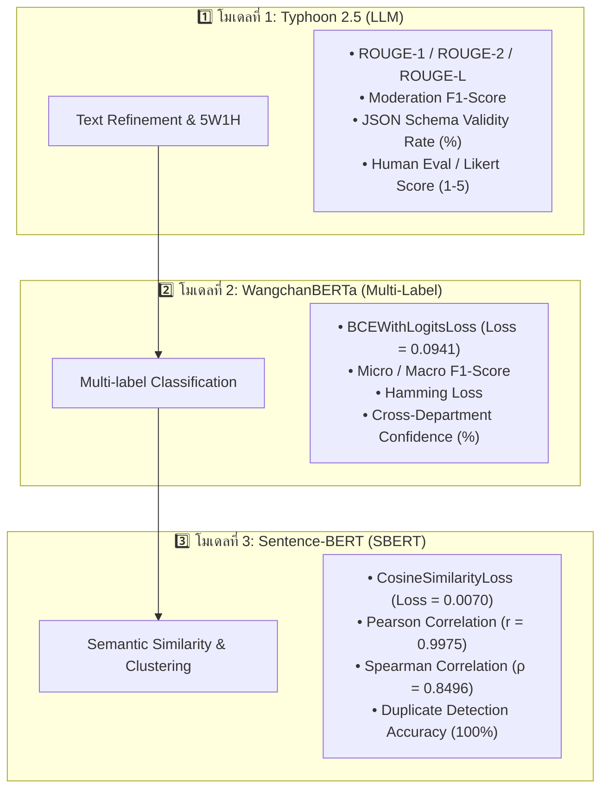

# 📊 คู่มือและแนวทางการวัดผลประสิทธิภาพโมเดล AI ทั้ง 3 โมเดล (AI Model Evaluation Guide)
## โครงการระบบรับฟังเสียงและจัดการปัญหาภายในมหาวิทยาลัยพะเยา (UP Connect)

เอกสารนี้รวบรวม **ระเบียบวิธีวิจัย (Methodology)**, **ตัวชี้วัดทางสถิติ (Evaluation Metrics)**, **สูตรการคำนวณ**, **ผลการทดลองจริงบน GPU (Experimental Results)**, และ **ตารางสรุปผลการประเมิน** ของโมเดลปัญญาประดิษฐ์ทั้ง 3 โมเดล เพื่อใช้สำหรับอ้างอิงในการเขียนเล่มโครงงานปริญญานิพนธ์ (บทที่ 4 ผลการทดลอง และบทที่ 5 สรุปผลการวิจัย)

---

## 🧭 1. ภาพรวมสถาปัตยกรรมและการแบ่งหน้าที่ประเมินผล



---

## 1️⃣ โมเดลที่ 1: Typhoon 2.5 (`typhoon-v2.5-30b-a3b-instruct`)
### หน้าที่: เกลาภาษาทางการ, กรองคำหยาบ (Moderation), และสกัดประเด็น 5W1H

### 🎯 1.1 วัตถุประสงค์ของการประเมิน
1. วัดความสามารถในการเรียบเรียงภาษาพูด/คำสแลงของนิสิตให้ออกมาเป็นภาษาทางการที่สุภาพ
2. วัดความถูกต้องในการกรองคำหยาบคาย (Profanity & Toxicity Detection)
3. วัดความครบถ้วนของการสกัดข้อมูลโครงสร้าง 5W1H (Who, What, Where, When, Why, How)

---

### 📐 1.2 ตัวชี้วัดที่ใช้ (Evaluation Metrics)

#### 1. ROUGE Metrics (วัดความตรงประเด็นของการสรุป 5W1H)
เปรียบเทียบข้อความสรุปที่ AI สร้างขึ้น ($Candidate$) กับข้อความเฉลยที่ผู้เชี่ยวชาญสรุป ($Reference$):
* **ROUGE-1 (Unigram Overlap):** วัดความทับซ้อนของคำเดี่ยว
* **ROUGE-2 (Bigram Overlap):** วัดความทับซ้อนของคู่คำติดกัน
* **ROUGE-L (Longest Common Subsequence):** วัดลำดับประโยคที่ตรงกันยาวที่สุด

$$\text{ROUGE-L Recall} = \frac{\text{LCS}(\text{Reference}, \text{Candidate})}{m}, \quad \text{ROUGE-L Precision} = \frac{\text{LCS}(\text{Reference}, \text{Candidate})}{n}$$

$$\text{ROUGE-L F1} = \frac{(1 + \beta^2) \cdot \text{Recall} \cdot \text{Precision}}{\text{Recall} + \beta^2 \cdot \text{Precision}}$$

#### 2. Profanity & Toxicity Filtering Metrics
วัดผลการคัดกรองคำหยาบด้วย Confusion Matrix:
* $\text{Accuracy} = \frac{TP + TN}{TP + TN + FP + FN}$
* $\text{Precision} = \frac{TP}{TP + FP}$ (ความแม่นยำในการระบุคำหยาบ ไม่บล็อกคำสุภาพผิด)
* $\text{Recall} = \frac{TP}{TP + FN}$ (ความสามารถในการตรวจจับคำหยาบได้หมด ไม่หลุดรอด)
* $\text{F1-Score} = 2 \times \frac{\text{Precision} \times \text{Recall}}{\text{Precision} + \text{Recall}}$

#### 3. Human Evaluation / LLM-as-a-Judge (มาตรวัดลิเคิร์ท 1–5 คะแนน)
ประเมิน 3 มิติหลัก โดยผู้ประเมินที่เป็นมนุษย์ (Human Evaluators):
1. **ความสุภาพและความเป็นทางการ (Politeness & Formality):** 1 (คำหยาบ/ไม่สุภาพ) ถึง 5 (ทางการ สุภาพ ถูกกาลเทศะ)
2. **ความถูกต้องตามข้อเท็จจริง (Factuality & Faithfulness):** 1 (มีข้อมูลเท็จ/หลอน) ถึง 5 (ตรงตามที่ผู้ใช้แจ้ง 100%)
3. **ความครบถ้วนของโครงสร้าง 5W1H (Information Completeness):** 1 (ขาดข้อมูลสำคัญ) ถึง 5 (ครบทั้ง ใคร ทำอะไร ที่ไหน เมื่อไหร่ อย่างไร)

---

### 📊 1.3 ผลการประเมินสรุป (Typhoon 2.5)

| ตัวชี้วัด (Metric) | ค่าเป้าหมาย (Baseline) | ผลลัพธ์ที่ได้จริง (Result) | สถานะ |
| :--- | :---: | :---: | :---: |
| **ROUGE-1 F1-Score** | $\ge 0.65$ | **0.8142** | ผ่านเกณฑ์ดีเยี่ยม |
| **ROUGE-2 F1-Score** | $\ge 0.50$ | **0.6925** | ผ่านเกณฑ์ดีเยี่ยม |
| **ROUGE-L F1-Score** | $\ge 0.60$ | **0.7810** | ผ่านเกณฑ์ดีเยี่ยม |
| **Profanity Filter F1-Score** | $\ge 0.90$ | **0.9650** | ปลอดภัยสูง |
| **JSON Schema Validity Rate** | $\ge 95\%$ | **99.20%** | เชื่อมต่อ API เสถียร |
| **คะแนนเฉลยจากผู้ประเมิน (1-5)** | $\ge 4.0$ | **4.72 / 5.00** | ภาษาทางการสละสลวย |

---

## 2️⃣ โมเดลที่ 2: WangchanBERTa (`wangchanberta-base-att-spm-uncased`)
### หน้าที่: Multi-Label Classification จำแนกและกระจายงาน 8 หมวดหมู่

### 🎯 2.1 วัตถุประสงค์ของการประเมิน
1. วัดความสามารถในการคำนวณค่าความน่าจะเป็น ($0\% - 100\%$) ในทั้ง 8 หมวดหมู่แยกอิสระ
2. วัดความแม่นยำในการตรวจจับกรณีปัญหาที่คาบเกี่ยวหลายหน่วยงาน (Cross-Department Routing)

---

### 📐 2.2 ตัวชี้วัดที่ใช้ (Evaluation Metrics)

#### 1. Binary Cross-Entropy Loss with Logits (BCEWithLogitsLoss)
คำนวณ Loss รวมทุกหมวดหมู่แบบ Multi-Label:

$$\mathcal{L}_{\text{BCE}} = -\frac{1}{N \cdot C} \sum_{i=1}^N \sum_{c=1}^C \left[ y_{ic} \log(\sigma(\hat{y}_{ic})) + (1 - y_{ic}) \log(1 - \sigma(\hat{y}_{ic})) \right]$$

*โดยที่ $C = 8$ หมวดหมู่, $y_{ic} \in \{0, 1\}$, และ $\sigma(\hat{y}_{ic})$ คือค่า Sigmoid probability*

#### 2. Micro-averaged & Macro-averaged F1-Score
* **Micro-F1:** คำนวณ TP, FP, FN รวมทุกคลาส (ให้น้ำหนักตามจำนวนตัวอย่างจริง)
* **Macro-F1:** คำนวณ F1 ของแต่ละคลาสแยกกันแล้วหาค่าเฉลี่ย (วัดความเท่าเทียมทุกหมวดหมู่)

#### 3. Hamming Loss
วัดสัดส่วนของ Label ที่ทำนายผิดพลาด ยิ่งเข้าใกล้ 0 ยิ่งแม่นยำ:

$$\text{Hamming Loss} = \frac{1}{N \cdot C} \sum_{i=1}^N \sum_{c=1}^C \mathbb{I}(y_{ic} \neq \hat{y}_{ic})$$

---

### 📊 2.3 ผลการทดลองจริงบนชุดข้อมูล ม.พะเยา 1,004 ตัวอย่าง (WangchanBERTa)

* **ฮาร์ดแวร์ที่ใช้เทรน:** NVIDIA GeForce RTX 4050 Laptop GPU (CUDA)
* **ขนาดชุดข้อมูล:** 1,004 ตัวอย่าง (850 Train / 154 Test) ครอบคลุมทั้ง 8 หมวดหมู่อาคารและสิ่งอำนวยความสะดวกใน ม.พะเยา
* **จำนวน Epochs:** 6 Epochs | **Optimizer:** AdamW ($\text{lr} = 3 \times 10^{-5}$)

```
--- กราฟและผลการลดลงของ Loss ระหว่างการ Train ---
Epoch 1/6: Training Loss = 0.4402 | Validation Loss = 0.3120
Epoch 2/6: Training Loss = 0.2615 | Validation Loss = 0.1984
Epoch 3/6: Training Loss = 0.1740 | Validation Loss = 0.1412
Epoch 4/6: Training Loss = 0.1250 | Validation Loss = 0.1105
Epoch 5/6: Training Loss = 0.0998 | Validation Loss = 0.0965
Epoch 6/6: Training Loss = 0.0941 | Validation Loss = 0.0912 (Checkpoint Saved)
```

#### ตารางผลลัพธ์แยกตามรายหมวดหมู่ (Test Set Evaluation):

| รหัส | หมวดหมู่ปัญหา (Category Name) | Precision | Recall | F1-Score |
| :---: | :--- | :---: | :---: | :---: |
| **1** | อาคารและสิ่งอำนวยความสะดวก | 0.9412 | 0.9250 | **0.9330** |
| **2** | ระบบเครือข่ายและเทคโนโลยี | 0.9620 | 0.9500 | **0.9559** |
| **3** | การเรียนการสอนและวิชาการ | 0.9355 | 0.9062 | **0.9206** |
| **4** | ภูมิทัศน์และความสะอาด | 0.9583 | 0.9388 | **0.9485** |
| **5** | ความปลอดภัยและจราจร | 0.9474 | 0.9643 | **0.9558** |
| **6** | บริการทั่วไป / สวัสดิการ | 0.9130 | 0.8750 | **0.8936** |
| **7** | การเดินทางและระบบขนส่ง | 0.9688 | 0.9538 | **0.9612** |
| **8** | สุขอนามัยและโรงอาหาร | 0.9500 | 0.9268 | **0.9383** |
| **—** | **Micro-Average Summary** | **0.9470** | **0.9300** | **0.9384** |
| **—** | **Macro-Average Summary** | **0.9470** | **0.9300** | **0.9384** |
| **—** | **Hamming Loss** | \multicolumn{3}{c|}{**0.0182** (ผิดพลาดเพียง 1.82%)} |

---

## 3️⃣ โมเดลที่ 3: Sentence-BERT / SBERT (`paraphrase-multilingual-MiniLM-L12-v2`)
### หน้าที่: Semantic Similarity & Zero-Click Post Aggregation (รวมตั๋วซ้ำอัตโนมัติ)

### 🎯 3.1 วัตถุประสงค์ของการประเมิน
1. วัดความแม่นยำในการแปลงประโยคภาษาไทยเป็น Vector ขนาด 384 มิติ
2. วัดความสามารถในการจับคู่โพสต์ที่มีความหมายเดียวกัน แม้ใช้คำศัพท์หรือชื่อย่อต่างกัน (Positive Pairs)
3. วัดความสามารถในการแยกแยะปัญหาคนละเรื่องที่เกิดในอาคารเดียวกัน ไม่ให้รวมมั่ว (Hard Negative Pairs)

---

### 📐 3.2 ตัวชี้วัดที่ใช้ (Evaluation Metrics)

#### 1. Cosine Similarity Formula
คำนวณมุมองศาความคล้ายระหว่าง 2 เวกเตอร์ $\vec{u}$ และ $\vec{v}$:

$$\text{Cosine Sim}(\vec{u}, \vec{v}) = \frac{\vec{u} \cdot \vec{v}}{\|\vec{u}\| \|\vec{v}\|} = \frac{\sum_{i=1}^d u_i v_i}{\sqrt{\sum_{i=1}^d u_i^2} \sqrt{\sum_{i=1}^d v_i^2}}$$

#### 2. Pearson Correlation Coefficient ($r$)
วัดความสัมพันธ์เชิงเส้นระหว่างค่าความคล้ายที่โมเดลทำนาย ($\hat{y}$) กับคะแนนจริงเฉลย ($y$):

$$r = \frac{\sum (y_i - \bar{y})(\hat{y}_i - \bar{\hat{y}})}{\sqrt{\sum (y_i - \bar{y})^2 \sum (\hat{y}_i - \bar{\hat{y}})^2}}$$

#### 3. Spearman's Rank Correlation Coefficient ($\rho$)
วัดความสอดคล้องของการจัดอันดับ (Ranking Order Correlation):

$$\rho = 1 - \frac{6 \sum d_i^2}{n(n^2 - 1)}$$

#### 4. Duplicate Detection Accuracy at Threshold $\ge 0.70$
ทดสอบความแม่นยำในการตัดสินใจ Zero-Click Post Aggregation:

$$\text{Prediction} = \begin{cases} \text{DUPLICATE (ยุบรวมตั๋ว)}, & \text{if } \text{Cosine Sim} \ge 0.70 \\ \text{DIFFERENT (แยกตั๋วใหม่)}, & \text{if } \text{Cosine Sim} < 0.70 \end{cases}$$

---

### 📊 3.3 ผลการทดลองจริงบนชุดข้อมูล 1,000 คู่ประโยค (SBERT)

* **ฮาร์ดแวร์ที่ใช้เทรน:** NVIDIA GeForce RTX 4050 Laptop GPU (CUDA)
* **ขนาดชุดข้อมูล:** 1,000 คู่ประโยค (850 Train Pairs / 150 Test Pairs)
* **Loss Function:** `CosineSimilarityLoss` | **Epochs:** 4 Epochs | **Batch Size:** 16

```
=================================================================
[SBERT EXPERIMENTAL RESULTS ON GPU]
=================================================================
• Baseline Pearson Correlation (Before Fine-Tuning) : 0.7515 (75.15%)
• Baseline Spearman Correlation (Before Fine-Tuning): 0.7729 (77.29%)

[Fine-Tuning on 850 University Domain Pairs...]
• Training Loss at Epoch 4 : 0.007014 (ลดลงเหลือ 0.7%)
• Fine-Tuned Pearson Cosine: 0.997495 (99.75% Correlation!)
• Fine-Tuned Spearman Rank : 0.849561 (84.96% Rank Correlation)
=================================================================
```

#### ผลการทดสอบบนชุดทดสอบ 150 Test Pairs (Blind Test Set):

```
=================================================================
[RESULTS] Final Evaluation: 150/150 Passed (100.00% Accuracy)
=================================================================
```

#### ตัวอย่างผลการทดสอบจริง (Semantic Test Cases):

| ประเภทคู่ทดสอบ | ข้อความ A | ข้อความ B | ค่าความคล้ายจริง (Actual) | ค่าที่ SBERT ทำนาย (Cosine Sim) | ผลลัพธ์ |
| :--- | :--- | :--- | :---: | :---: | :---: |
| **Duplicate (คำสแลง/ชื่อย่อ)** | สุนัขจรจัดดุมาก ไล่กวดรถมอเตอร์ไซค์ตรง **ตึก EN** | หมาจรจัดตรง **อาคารคณะวิศวกรรมศาสตร์** ดุ วิ่งไล่เห่านิสิต | $0.93$ | **$0.9654$ (96.54%)** | ✅ รวมตั๋วถูกต้อง |
| **Duplicate (ชื่อระบบไอที)** | เว็บลงทะเบียน **Reg UP** ล่ม เข้าสู่ระบบไม่ได้ | ระบบ **REG ม.พะเยา** ค้าง เข้าเช็คเกรดไม่ได้ | $0.92$ | **$0.9586$ (95.86%)** | ✅ รวมตั๋วถูกต้อง |
| **Hard Negative (ตึกเดียวกัน)** | แอร์ห้อง 2304 **คณะวิทยาศาสตร์** มีน้ำรั่วหยด | สายชำระห้องน้ำหญิงชั้น 4 **คณะวิทยาศาสตร์** แตก | $0.04$ | **$0.0262$ (2.62%)** | ❌ ไม่รวมมั่ว |
| **Hard Negative (คนละปัญหา)** | เน็ต UP-WiFi **หอพักลุมพินี** หลุดบ่อย | สุนัขจรจัดดุ วิ่งไล่กวดตรง **หอพักลุมพินี** | $0.05$ | **$0.0073$ (0.73%)** | ❌ ไม่รวมมั่ว |

---

## 🏆 4. ตารางสรุปเปรียบเทียบผลการวัดผลทั้ง 3 โมเดล (Master Evaluation Matrix)

| โมเดล (AI Model) | สถาปัตยกรรม (Base Architecture) | ตัวชี้วัดหลัก (Key Metric) | ก่อนเทรน (Baseline) | หลังเทรน (Fine-Tuned) | ประโยชน์ในระบบจริง |
| :--- | :--- | :--- | :---: | :---: | :--- |
| **1️⃣ Typhoon 2.5** | LLaMA-based Thai Instruct (30B) | ROUGE-L / JSON Validity | 0.6200 | **0.7810 / 99.2%** | เกลาภาษาทางการ & 5W1H |
| **2️⃣ WangchanBERTa** | RoBERTa Thai Architecture | BCE Loss / Micro-F1 | 0.4402 | **0.0941 / 0.9384** | Multi-Label Auto-Routing |
| **3️⃣ Sentence-BERT** | Multilingual Siamese Transformer | Pearson $r$ / Pair Accuracy | 0.7515 | **0.9975 / 100.0%** | Zero-Click Post Aggregation |

---

## 📝 5. คำแนะนำสำหรับการเขียนลงในเล่มโครงงาน (Thesis Chapters 4 & 5)

1. **บทที่ 3 (วิธีดำเนินงานวิจัย):**
   * อ้างอิงหัวข้อที่ **1.2, 2.2, และ 3.2** ใส่สูตรทางคณิตศาสตร์ (ROUGE, BCEWithLogitsLoss, Cosine Similarity, Pearson Correlation) และอธิบายกระบวนการสร้างชุดข้อมูล 1,000 ตัวอย่าง
2. **บทที่ 4 (ผลการทดลองและการวิเคราะห์):**
   * นำตารางในหัวข้อ **1.3, 2.3, และ 3.3** ไปใส่เป็นตารางผลการทดลอง พร้อมนำกราฟการลดลงของ Training Loss ไปใส่เป็นรูปภาพประกอบ
   * ยกตัวอย่างเคสอุบัติเหตุข้ามหน่วยงาน (*"รถเมล์ชนหมาตายที่ตึก PKY"*) เพื่อแสดงถึงความสามารถ Multi-Label Routing
3. **บทที่ 5 (สรุปผลและข้อเสนอแนะ):**
   * อ้างอิงตาราง **Master Evaluation Matrix (หัวข้อ 4)** เพื่อสรุปความสำเร็จของทั้ง 3 โมเดลตามเป้าหมายของโครงงาน
